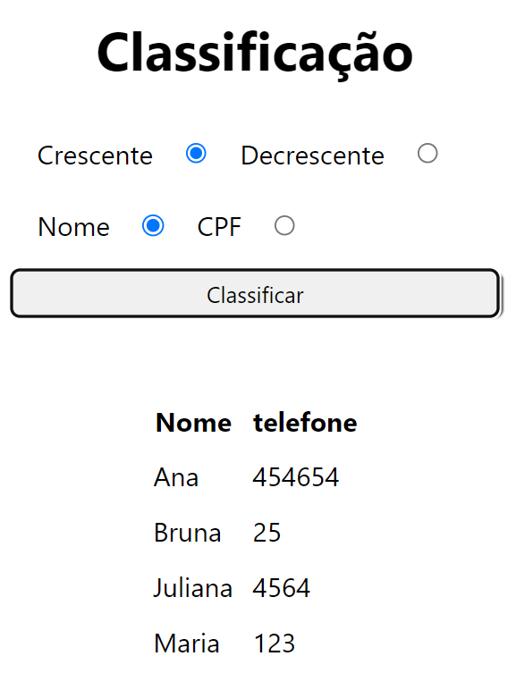
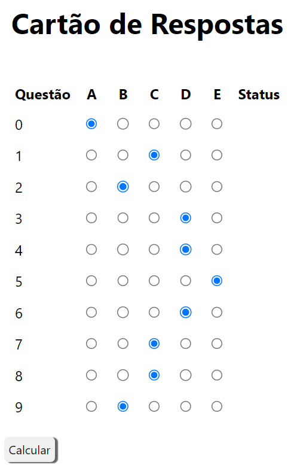
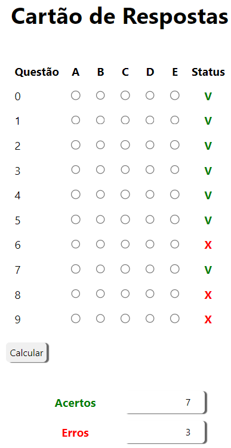
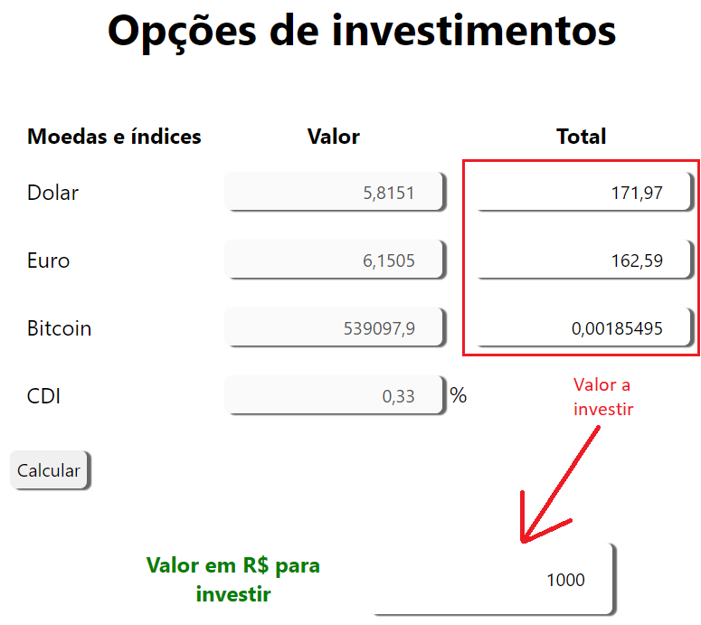

# Desafios Lógica
## Seletiva local - Olimpíadas do Conhecimento
# São Paulo Skills

## Instruções
Os desafios a seguir são para testar sua habilidade em resolver problemas aplicando a lógica de programação. Você pode escolher a linguagem de programação que desejar para resolver os desafios. 
Tente não utilizar IAs para resolver os problemas, pois o objetivo é avaliar sua capacidade de resolver problemas com lógica de programação. 
Resolva exatamente como foi solicitado, não altere o enunciado do problema. 
Realize a entrega conforme instruções no final do documento.

## Desafio 1 - Classificação SORT
|Contextualização|
|-|
|Em diversos sistemas temos cadastros, e a primeira forma de consultar um cadastro é classificando|

|Desafio|
|-|
|Crie um programa que receba como entrada uma lista nome e CPF de diversos cadidatos, ao concluir as entradas o programa deve solicitar ao usuário que informe se quer classificar por nome ou CPF de forma crescente ou decrescente|
- Exemplo de entradas
 
|Nome|CPF|
|-|-|
|Maria|123|
|Juliana|4564|
|Ana|454654|
|Bruna|25|

- Exemplo de saída
    - Classificada por nome
 
|Nome|CPF|
|-|-|
|Ana|454654|
|Bruna|25|
|Juliana|4564|
|Maria|123|

- Exemplo de saída
    - Classificada por CPF
 
|Nome|CPF|
|-|-|
|Bruna|25|
|Maria|123|
|Juliana|4564|
|Ana|454654|

## Desafio 2 - Cartão de Respostas
|Contextualização|
|-|
|Para facilitar a correção da prova. A professora Diana fez todas as questões de multipla escolha, e distribuiu ao seus alunos um cartão de respostas com 10 questões de 5 alternativas, cada questão possui apenas uma alternativa correta, conforme modelo a seguir|

|Questão|A|B|C|D|E|
|-|-|-|-|-|-|
|1||||||
|2||||||
|3||||||
|4||||||
|5||||||
|6||||||
|7||||||
|8||||||
|9||||||
|10||||||

### Gabarito
1;A
2;B
3;C
4;D
5;D
6;C
7;E
8;E
9;B
10;D

|Desafio|
|-|
|Crie um programa com uma inteface onde o aluno preencha a ficha de respostas e clique em um botão ou escolha uma opção de validar. O programa deve informar quantos acertos e erros foram computados, use sua criatividade para desenvolver esta interface|

## Desafio 3 - Estatísticas diárias
|Contextualização|
|-|
|Dona Nina, investidora agressiva, precisa de um App ou Site que mostre informações do mercado de negócios|

|Desafio|
|-|
|Crie uma página web ou App que mostre os seguintes índices: - valor do dolar americano em reais - Valor do Euro em Reais - valor do bitcoin em reais - O ínice CDI (Certificado de Depósito Interbancário) atual, o apicativo deve solicitar que informe quanto deseja investir em R$ Reais e calcular quanto de cada moeda poderá comprar, não é necessário calcular nada para o CDI|

### Exemplo
|Moedas e Índices|Valor|
|-|-|
|Dolar|4,97|
|Euro|5,45|
|Bitcoin|341500,00|
|CDI|0,55%|

- Deseja investir: 1000 **Calcular**

|Moedas e Índices|Valor|Total|
|-|-|-|
|Dolar|4,97|201,20|
|Euro|5,45|183,48|
|Bitcoin|341500,00|0,0029|
|CDI|0,55%|1000|

|Entrega|
|-|
|Crie um repositório no seu github chamado **desafiologica** e envie os três desafios, crie um arquivo README.md com instruções de quais tecnologias/linguagens de programação utilizou e como executar/testar os programas, caso tenha feito com tecnologias **web** habilite o github pages para este repositório e anexe o link para executar na aba **sobre/about**|
|Envie o link do repositório neste **[forms](https://docs.google.com/forms/d/e/1FAIpQLSejcMWMErfDkNRHgDm2C2Ga-YNUU_Ir8khzn-kk-KDAzP-PlA/viewform?usp=sf_link)**|
